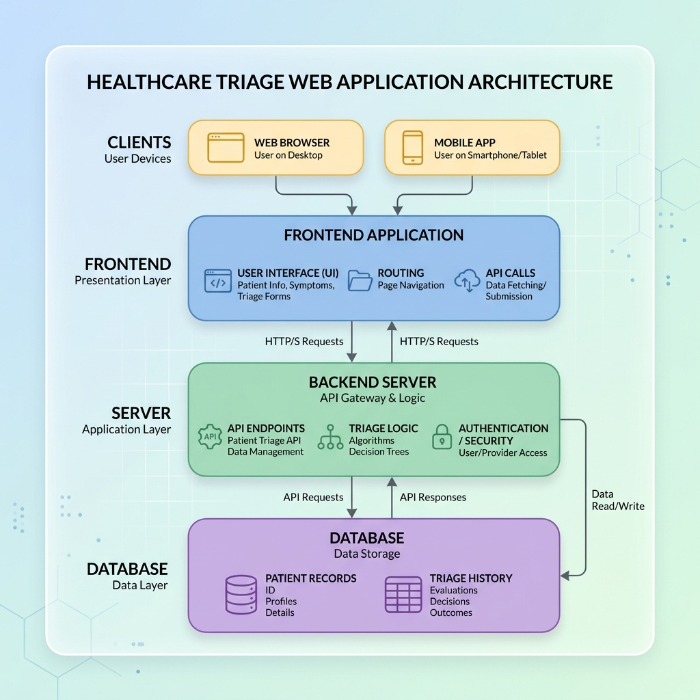
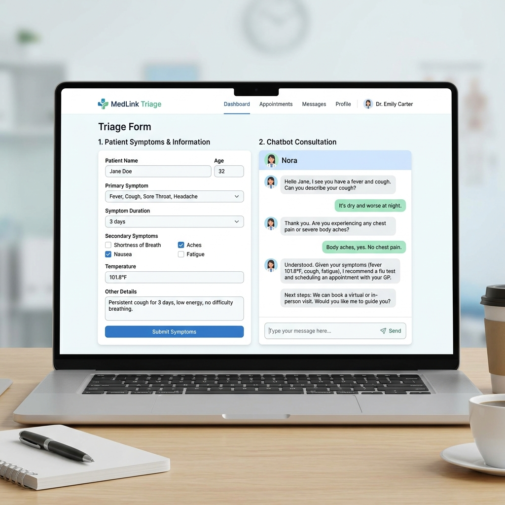

# AuraTriage भारत




## Project Overview

**AuraTriage भारत** is a healthcare triage assistant built with Python, FastAPI, and a modern web UI. It allows users to input patient symptoms and receive AI‑generated preliminary assessments and next‑step recommendations. The backend leverages a large language model (LLM) via the Google AI API.

## Features
- Simple web interface for symptom entry
- Real‑time streaming responses using Server‑Sent Events (SSE)
- Dockerized deployment for easy scaling
- Extensible architecture for adding more medical domains

## Architecture Diagram


## Quick Start

1. **Install dependencies**
```bash
pip install -r requirements_triage.txt
```
2. **Set up environment variables** – create a `.env` file with your Google API key:
```
GOOGLE_API_KEY=your_key_here
```
### 3a. Run via ADK CLI (no web UI)
```bash
# Run the agent interactively
adk run crop_disease_agent

# Visualize the graph in the ADK web inspector
adk web .
```

### 3b. Run with Web UI (full demo)
```bash
python -m uvicorn web_ui.server:app --reload --port 8000
# Open http://localhost:8000
```

---

## 📁 Project Structure

```
Cpstone Project/
├── crop_disease_agent/          # ADK 2.0 agent package
│   ├── __init__.py              # Exports root_agent for ADK CLI
│   ├── agent.py                 # VisionAgent, RemedyAgent, ReportAgent + SequentialAgent graph
│   ├── tools.py                 # ADK tool functions (fetch_remedies, save_to_state)
│   ├── prompts.py               # Centralized agent instruction strings
│   └── disease_db.py            # Disease knowledge base (15+ diseases)
│
├── web_ui/                      # Demo web interface
│   ├── server.py                # FastAPI + SSE streaming server
│   └── index.html               # Premium dark glassmorphism UI
│
├── requirements.txt             # Python dependencies
├── .env                         # API key configuration
└── README.md
```

---

## 🌾 Supported Diseases

The knowledge base covers **15+ crop diseases** including:
- Late Blight, Early Blight (Phytophthora, Alternaria)
- Powdery Mildew, Downy Mildew
- Mosaic Virus (TMV, CMV, BYMV)
- Rust (leaf, stem, stripe)
- Bacterial Leaf Blight (rice)
- Tomato Yellow Leaf Curl Virus
- Anthracnose, Fusarium Wilt
- Septoria Leaf Spot, Cercospora Leaf Spot
- Black Spot, Crown Rot

---

## 🔬 How VisionAgent Works

VisionAgent is configured as an `LlmAgent` with Gemini 2.5 Flash, which natively supports multimodal inputs (text + image):

```python
vision_agent = LlmAgent(
    name="VisionAgent",
    model="gemini-2.5-flash",         # Multimodal model
    instruction=VISION_AGENT_INSTRUCTION,  # Strict JSON schema prompt
    tools=[save_vision_analysis_to_state], # Saves to session state
    output_key="vision_analysis",     # ADK auto-saves text to state
)
```

The agent outputs a structured JSON object with:
- `disease_name`, `disease_key`, `confidence`
- `severity` (low/medium/high), `affected_area_percent`
- `primary_symptoms`, `visual_evidence`
- `differential_diagnoses`

This JSON is saved to `session.state["vision_analysis"]` so RemedyAgent can read it via `{vision_analysis}` placeholder injection.

---

## 🔧 ADK 2.0 Key Patterns Used

| Pattern | How Used |
|---------|----------|
| `SequentialAgent` | Root workflow orchestrating all 3 nodes in order |
| `LlmAgent` | Each node — VisionAgent, RemedyAgent, ReportAgent |
| `output_key` | Auto-saves agent text response to session state |
| `ToolContext` | Tools write to `tool_context.state` for richer state control |
| `{placeholder}` | State injection into agent instructions |
| `InMemorySessionService` | Session state management per request |
| `Runner` | Executes the agent graph asynchronously |

---

## ⚠️ Disclaimer

Agricultural advice from this system is AI-generated and should be validated by a licensed agronomist before applying any chemical treatments. Always follow local regulations for pesticide use.
